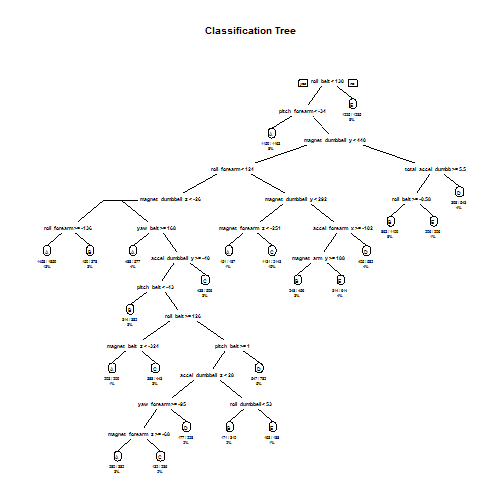

##**Summary**

The aim of this work is to build the best predictive model that predict the manner in which the authors did the exercise of producing the classes in their paper.
For that end, we build two models using the random forest method and the regression partition tree. We evaluated the accuracy of each method on a subsetted training and test set. The random forest method appeared to be the best.

##**The model selection**
The libraries needed


We set the seed


```r
set.seed(1234)
```

We load the two datasets.


```r
download.file("https://d396qusza40orc.cloudfront.net/predmachlearn/pml-testing.csv","pml.testing.csv")
download.file("https://d396qusza40orc.cloudfront.net/predmachlearn/pml-training.csv","pml.training.csv")
```


```r
training <- read.csv("pml.training.csv", na.strings = c("NA","#DIV/0!",""))
testing <- read.csv("pml.testing.csv", na.strings=c("NA","#DIV/0!",""))
```

We delete the rows with NA


```r
training <- training[,colSums(is.na(training))==0]
testing <- testing[,colSums(is.na(testing))==0]
```

We delete columns we don't need for our analysis


```r
training2 <- training[,-c(1:7)]
```


```r
testing2 <- testing[,-c(1:7)]
```

We partion the training set in two subsets that will be used to select the the best method to use for the prediction on the original testing set.


```r
inTrain <- createDataPartition(training2$classe,p=3/4, list = FALSE)
training3 <- training2[inTrain,]
testing3 <- training2[-inTrain,]
```


```r
 dim(training3)
```

```
## [1] 14718    53
```


```r
 dim(testing3)
```

```
## [1] 4904   53
```


We start by fitting with the regression partition tree.


```r
fit.rpart <- rpart(classe~.,data = training3,method = "class") 
mod.rpart <- predict(fit.rpart, newdata = testing3,type = "class")
```

We can plot the tree below.


```r
rpart.plot(fit.rpart, main="Classification Tree", extra=102, under=TRUE, faclen=0)
```



We use the confusion matrix for accuracy.


```r
confusionMatrix(mod.rpart, testing3$classe)
```

```
## Confusion Matrix and Statistics
## 
##           Reference
## Prediction    A    B    C    D    E
##          A 1235  157   16   50   20
##          B   55  568   73   80  102
##          C   44  125  690  118  116
##          D   41   64   50  508   38
##          E   20   35   26   48  625
## 
## Overall Statistics
##                                           
##                Accuracy : 0.7394          
##                  95% CI : (0.7269, 0.7516)
##     No Information Rate : 0.2845          
##     P-Value [Acc > NIR] : < 2.2e-16       
##                                           
##                   Kappa : 0.6697          
##  Mcnemar's Test P-Value : < 2.2e-16       
## 
## Statistics by Class:
## 
##                      Class: A Class: B Class: C Class: D Class: E
## Sensitivity            0.8853   0.5985   0.8070   0.6318   0.6937
## Specificity            0.9307   0.9216   0.9005   0.9529   0.9678
## Pos Pred Value         0.8356   0.6469   0.6313   0.7247   0.8289
## Neg Pred Value         0.9533   0.9054   0.9567   0.9296   0.9335
## Prevalence             0.2845   0.1935   0.1743   0.1639   0.1837
## Detection Rate         0.2518   0.1158   0.1407   0.1036   0.1274
## Detection Prevalence   0.3014   0.1790   0.2229   0.1429   0.1538
## Balanced Accuracy      0.9080   0.7601   0.8537   0.7924   0.8307
```

The second fit is with the random forest method.


```r
fit.rf <- randomForest(classe~.,data = training3,method = "class") 
mod.rf <- predict(fit.rf, newdata = testing3,type = "class")
```

We use the confusion matrix for accuracy.


```r
confusionMatrix(mod.rf, testing3$classe)
```

```
## Confusion Matrix and Statistics
## 
##           Reference
## Prediction    A    B    C    D    E
##          A 1394    3    0    0    0
##          B    1  944   10    0    0
##          C    0    2  843    6    0
##          D    0    0    2  798    0
##          E    0    0    0    0  901
## 
## Overall Statistics
##                                           
##                Accuracy : 0.9951          
##                  95% CI : (0.9927, 0.9969)
##     No Information Rate : 0.2845          
##     P-Value [Acc > NIR] : < 2.2e-16       
##                                           
##                   Kappa : 0.9938          
##  Mcnemar's Test P-Value : NA              
## 
## Statistics by Class:
## 
##                      Class: A Class: B Class: C Class: D Class: E
## Sensitivity            0.9993   0.9947   0.9860   0.9925   1.0000
## Specificity            0.9991   0.9972   0.9980   0.9995   1.0000
## Pos Pred Value         0.9979   0.9885   0.9906   0.9975   1.0000
## Neg Pred Value         0.9997   0.9987   0.9970   0.9985   1.0000
## Prevalence             0.2845   0.1935   0.1743   0.1639   0.1837
## Detection Rate         0.2843   0.1925   0.1719   0.1627   0.1837
## Detection Prevalence   0.2849   0.1947   0.1735   0.1631   0.1837
## Balanced Accuracy      0.9992   0.9960   0.9920   0.9960   1.0000
```

Predict outcome levels on the original test data set using Random Forest algorithm, the best of the two algorithms tested.


```r
modFin <- predict(fit.rf, newdata = testing2, type="class")
```

Write files for submission


```r
writeInFiles <- function(x){
        n = length(x)
        for(i in 1:n){
                filename = paste0("problem_id_",i,".txt")
                write.table(x[i],file=filename,quote=FALSE,row.names=FALSE,col.names=FALSE)
        }
}

writeInFiles(modFin)
```
